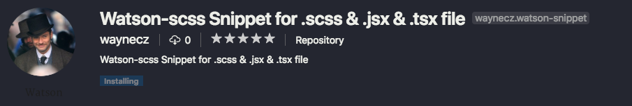

# Watson-scss Snippet for .scss & .jsx & .tsx file

This extension will add TypeScript snippet for Essential Angular Grid.

## React Snippets

Type the following text and press `enter` to insert the snippet.

| Snippet | Action                                                           |
| ------- | ---------------------------------------------------------------- |
| `blk`   | This will insert the snippet for `{...bem()}`                    |
| `ele`   | This will insert the snippet for `{...bem('::element')}`         |
| `mod`   | This will insert the snippet for `{...bem('::$1', { $$2: $2 })}` |
| `when`  | This will insert the snippet for `{...bem('::$1', { $2: $2 })}`  |

> See more at [react-bem-classname](https://github.com/waynecz/react-bem-classname)

## Sass Snippets

| Snippet | Action                                                       |
| ------- | ------------------------------------------------------------ |
| `blk`   | This will insert the snippet for `@include block($1) {}`     |
| `ele`   | This will insert the snippet for `@include element($1) {}`   |
| `mod`   | This will insert the snippet for `@include modifier($1) {}`  |
| `when`  | This will insert the snippet for `@include when($1) {}`      |
| `pse`   | This will insert the snippet for `@include pseudo($1) {}`    |
| `attr`  | This will insert the snippet for `@include with-attr($1) {}` |
| `hv`    | This will insert the snippet for `&:hover {}`                |

> See more at [watson-scss](https://github.com/waynecz/watson)
